#Behavioral Cloning
The idea of this project is to clone the human behavior to learn how to steer the car in a simulated track. The only information given to the model is a front view of the vehicle and the output expected is the steering angle of the wheel.

In order to meet this goal, it is necessary to train a Convolutional Neural Network, so it learns what to do in each scenario given a dataset with a bunch of images and a steering angles related to each one.

The figure bellow presents an image of both tracks of the [simulator](###simulator-download):

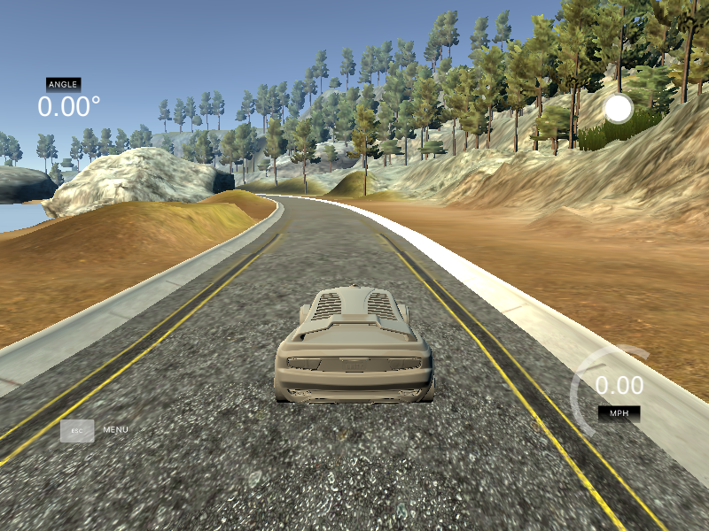
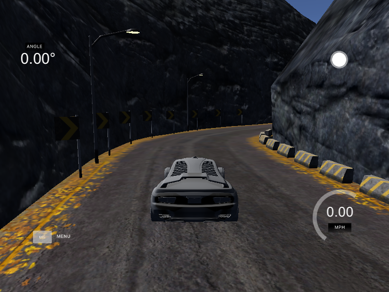

##Resources
There are a few files needed to run the Behavioral Cloning project.

The simulator contains two tracks. Sample driving data for the first track is included bellow, which can optionally be used to help train the network. It is also possible to collect the data using the record button on the simulator.

* [sample data for track 1](https://d17h27t6h515a5.cloudfront.net/topher/2016/December/584f6edd_data/data.zip)

###Simulator Download
* [Linux](https://d17h27t6h515a5.cloudfront.net/topher/2016/November/5831f0f7_simulator-linux/simulator-linux.zip)
* [macOS](https://d17h27t6h515a5.cloudfront.net/topher/2016/November/5831f290_simulator-macos/simulator-macos.zip)
* [Windows 32-bit](https://d17h27t6h515a5.cloudfront.net/topher/2016/November/5831f4b6_simulator-windows-32/simulator-windows-32.zip)
* [Windows 64-bit](https://d17h27t6h515a5.cloudfront.net/topher/2016/November/5831f3a4_simulator-windows-64/simulator-windows-64.zip)

###Beta Simulators
* [Linux](https://d17h27t6h515a5.cloudfront.net/topher/2017/February/5894ee55_beta-simulator-linux/beta-simulator-linux.zip)
* [macOS](https://d17h27t6h515a5.cloudfront.net/topher/2017/February/5894ecbd_beta-simulator-mac/beta-simulator-mac.zip)
* [Windows](https://d17h27t6h515a5.cloudfront.net/topher/2017/February/5894ea69_beta-simulator-windows/beta-simulator-windows.zip)

## Dataset
The dataset, provided by Udacity, found in [this link](https://d17h27t6h515a5.cloudfront.net/topher/2016/December/584f6edd_data/data.zip), contains the following data:

* Folder with 8.036 simulation images, showing the center, left and right camera view of the road, tantalizing 24.108 images
* File <em>driving\_log.csv</em> containing a list describing all the images with the following information
    * Center image path
    * Left image path
    * Right image path
    * Steering angle
    * Throttle
    * Brake
    * Speed

Bellow is an example of the images used to train the CNN, it is also shown how the steering angle is adjusted based on the image.
  
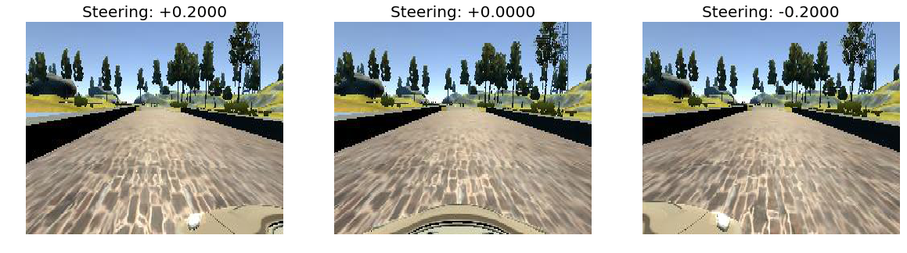

## Histogram
The image bellow presents the histogram of the given dataset, here is possible to notice that the number of images with steering angle equal to zero is much more representative.
  
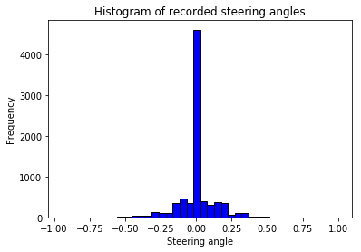

In order to have a more balanced dataset, it is necessary to eliminate good part of the zero angle steering examples. It was decided to consider only 8% of the total number, and the result is presented bellow.

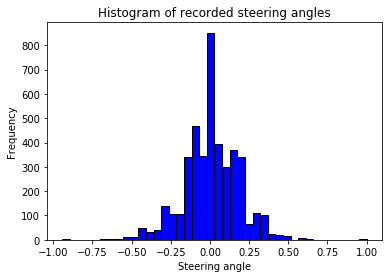

## Image Augmentation
In order to improve the learning task and make it more robust, it is necessary to augment the dataset, so more data is artificially generated based only on the given ones.

The following augmentation is used in this project:

* Flip
* Change image brightness
* Rotate
* Translate
* Shadow Shear
* Cut

Examples of each transformation will be presented bellow.

###Flip
In order to have a balanced dataset, it is useful to flip each image randomly, also inverting the sign of the steering angle.
  

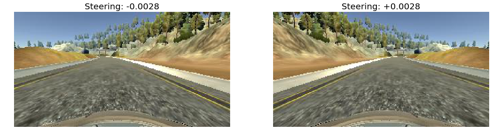

###Change image brightness
It is useful to change the image brightness in order to make the model learn how to generalize from a day to a rainy day or at night, for example. This can be achieved changing the V value of the converted image to HSV.
  
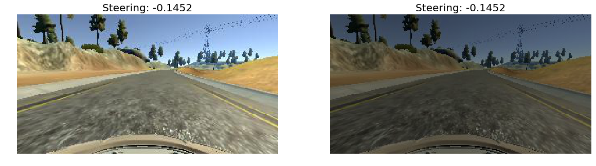

###Rotate
It is also possible to generate sloping angles, so the model learns how to generalize to these cases.
  
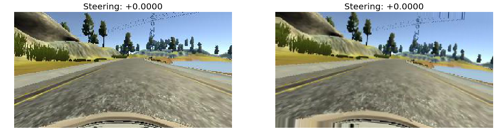

### Translate
Translating the image randomly makes it possible to generate even more data in different positions of the road, adding a proportional factor of this translation to the steering angle.
  
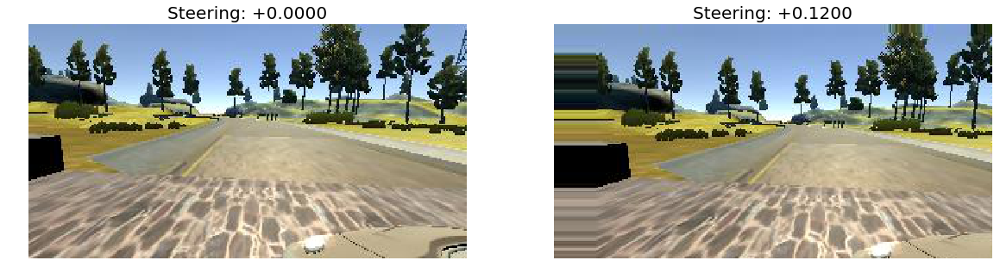

### Shadow
Shading randomly an image makes it more robust to shadows on the track, such as a tree, wires or poles.
  
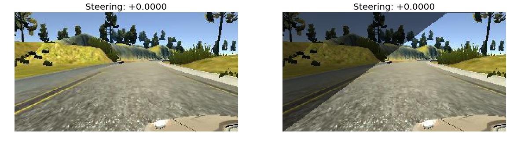

### Shear
Shearing the image is also usefull, once the 
  
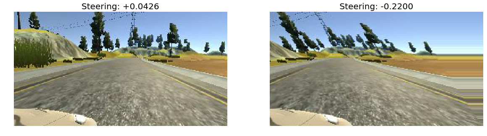

### Cut
In order to minimize the number of parameters of our CNN, it is possible to cut some unnecessary parts of the image, including the bottom, top and some few pixels on the sides.
  
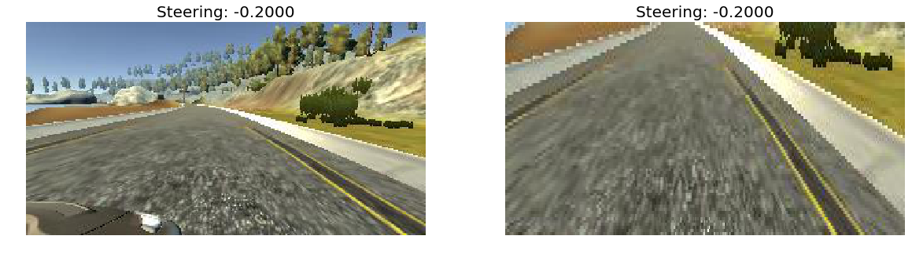

### Composed result
The image bellow shows an example of a composed treatment of an image.
  
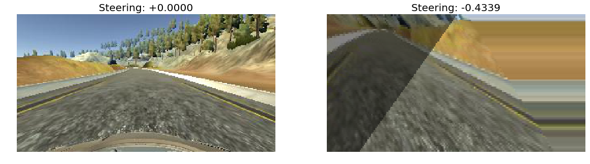

## Neural Network Architecture
The started Neural Network used for this project was the NVidia, however after a lot of trials and errors it was decided to switch to the [CommaAI](https://github.com/commaai/research/blob/master/train_steering_model.py).

The model is presented bellow:

### Training

### Validation
For the validation set, a sample of 20% was separated from the total amount of data.

## Results
Bellow is presented a video result running on the same track where the CNN was trained.

It was also tested on a track never seen before, and the result obtained is presented bellow:

## Conclusion and next steps
The task of adjusting the parameters, in order to get a satisfactory result is really difficult. Besides defining the architecture parameters, various others factors influence on the result, such as augmentation and dataset balance.

The first atempt in this project was the use of Nvidia model, however, I had a hard timing tuning it in order to have a model who could complete the track. After so many trials and errors I decided to try the ComaAI model, which from start seemed to be much more robust.

For next steps, I would try to also control the speed and break instead of only the steering, however, some more data would be necessary, such as the inclination of the vehicle.